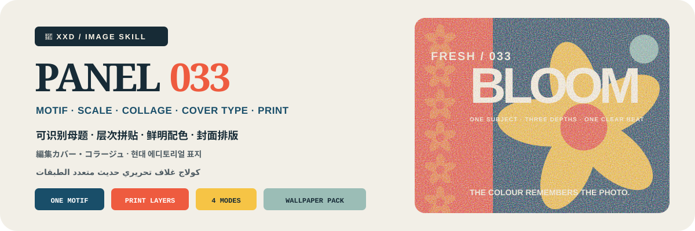
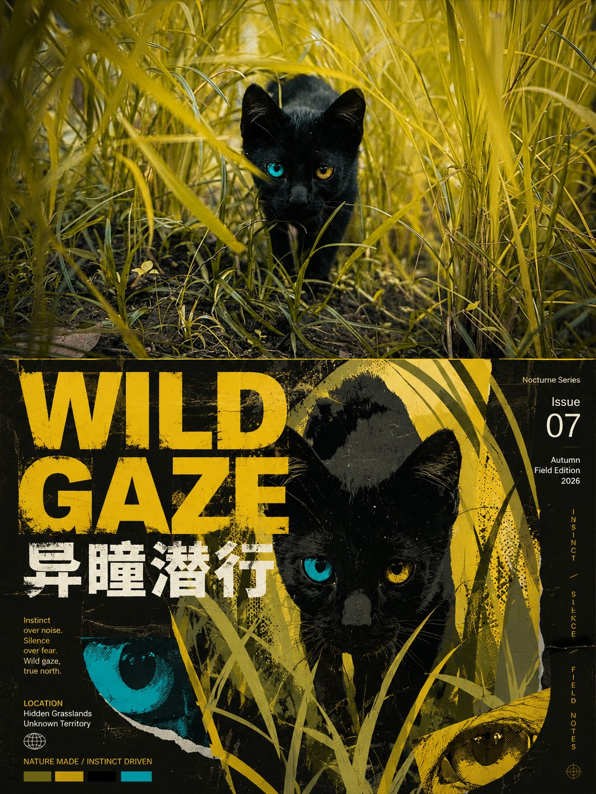
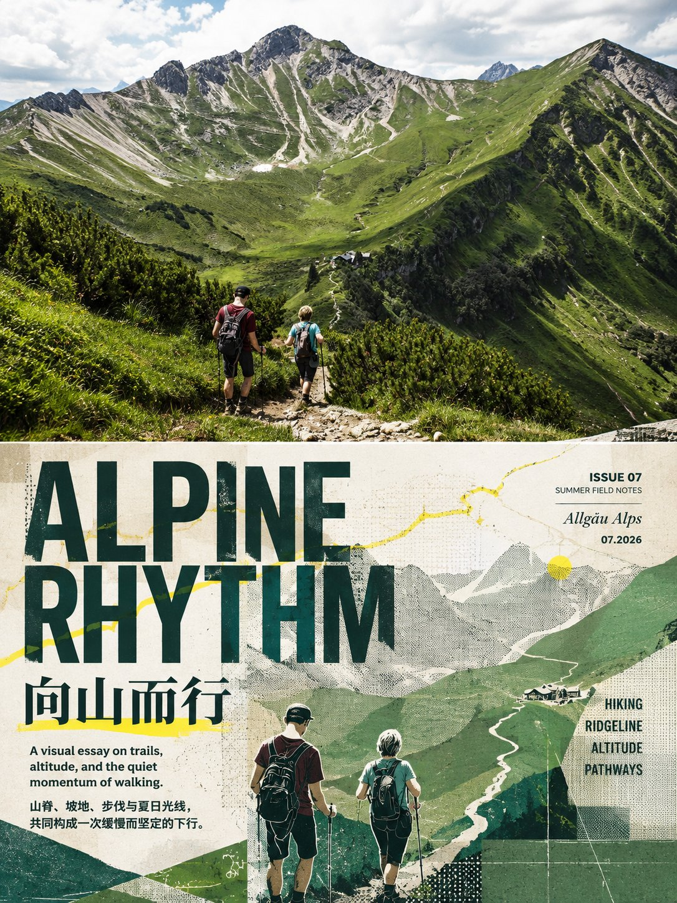

<p align="center">
  
</p>

<div align="center">

# 🦁 XXD Panel 033

### 한 장의 사진을 선명하고 다층적인 현대 잡지 표지 콜라주로

[](./SKILL.md)
[](#네-가지-출력-하나의-에디토리얼-표지-시스템)
[](#경계와-신뢰)

<a href="README.md">简体中文</a> · <a href="README.en.md">English</a> · <a href="README.ja.md">日本語</a> · <strong>한국어</strong> · <a href="README.ar.md">العربية</a>

</div>

> 식별 가능한 모티프 · 평면 콜라주 · 크기 대비 · 원본 기반 선명한 색 · 표지 타이포그래피

XXD Panel 033는 Codex와 호환 에이전트를 위한 이미지 생성 Skill입니다. 사진의 결정적인 주체, 윤곽, 자세, 환경 조각 또는 서사 관계를 하나의 식별 가능한 모티프로 줄이고, 반복, 확대, 크롭, 겹침, 평면 색과 인쇄 질감으로 현대 잡지 표지의 시각장을 만듭니다.

배경 모티프, 중간 주체, 전경 포인트는 서로 다른 역할과 크기를 갖습니다. 대상 언어의 대담한 글자는 가로지르기, 세로 쌓기, 겹침, 가림, 여백 배치로 화면에 참여하며, 선명한 색은 원본에서 추출해 면적과 명도로 절제합니다.

## 왜 033이 필요한가요

일반적인 ‘잡지 스타일’은 기성 제호, 무관한 스티커, 템플릿 타이포그래피, 원본과 관계없는 유행 색으로 쉽게 무너집니다.

033는 그 순서를 뒤집습니다.

```text
정체성／윤곽／자세／관계 고정 → 식별 가능한 모티프 하나 추출 → 배경·중경·전경 역할 설정 → 결정적인 크기 대비 생성 → 원본 기반 선명한 팔레트 통제 → 인쇄 질감 선택 → 강한 제목과 서사적 부제 작성 → 가로지르기·쌓기·겹침·활성 여백으로 대상 언어 타이포그래피 통합
```

무관한 사진으로 바꿔도 모티프, 층위, 반복 리듬, 크롭, 팔레트, 질감 또는 표지 문구가 거의 달라지지 않는다면 033가 아닙니다.

## 033의 시각적 원칙

- **원본 정체성:** 최소 세 가지 구체적 단서로 비율, 윤곽 흐름, 자세, 방향, 동작, 기능과 관계를 보존합니다.
- **식별 가능한 모티프 하나:** 주체, 윤곽, 자세, 환경 조각 또는 관계를 줄이되 세부를 기계적으로 베끼지 않습니다.
- **세 가지 깊이 역할:** 확대·반복 배경장, 지배적 중경 주체, 절제된 전경 포인트를 분명히 합니다.
- **결정적인 크기 대비:** 거대／미세, 근접 크롭／원거리 반복, 밀도／여백, 어두운 무게／밝은 포인트를 사용합니다.
- **원본 기반 팔레트:** 주색, 보조색, 무게를 잡는 어두운 색, 소량의 밝은 색을 면적과 명도로 통제합니다.
- **인쇄 촉감:** 입자, 망점, 격자, 직물, 스프레이, 전사, 마른 붓, 판 어긋남을 선택적으로 사용합니다.
- **통합 표지 타이포그래피:** 제목과 부제가 크기, 쌓기, 가로지르기, 겹침과 음형으로 화면에 참여합니다.
- **썸네일 위계:** 주체, 제목, 보조층 순서로 읽히며 초점은 하나입니다.

## 예시 · X에서

> [샤오샤오둥（@xiaoxiaodong01）](https://x.com/xiaoxiaodong01/status/2090714362709434623) · 2026-08-21<br>
> GPT2 x 喷墨 x 干刷 x 海报 x 美学提示词 x VOL.033

<table>
  <tr>
    <td width="50%"><a href="https://x.com/xiaoxiaodong01/status/2090714362709434623"></a></td>
    <td width="50%"><a href="https://x.com/xiaoxiaodong01/status/2090714362709434623"></a></td>
  </tr>
</table>

<p align="center"><a href="https://x.com/xiaoxiaodong01/status/2090714362709434623">원문 게시물과 전체 프롬프트 보기 →</a></p>

이 예시는 033의 미학적 의도를 보여 줄 뿐이며, 예시의 주제, 구성, 색상, 문구, 이전 캔버스 비율은 생성 참고나 현재 기본값이 되지 않습니다.

## 조합 가능한 네 가지 출력

`1`, `1+3`, `1,2,4`, `전체`로 하나 또는 여러 모드를 선택할 수 있으며 `전체`는 원본당 독립 PNG 7개를 만듭니다. 모드 선택 뒤, 생성 전에 완성 이미지 전체의 화면비를 반드시 확인합니다: 원래 프롬프트의 `3:4`, 명시적인 원본 비율, 일반 비율, 사용자 지정 비율／정확한 픽셀입니다. 원본 크기를 묵시적으로 적용하지 않습니다.

| 모드 | 화면비 규칙 | 결과물 |
| --- | --- | --- |
| `top-bottom` | 사용자가 확인한 전체 캔버스 | 완성 캔버스를 한 번에 생성: 위에 고충실도 원본, 아래에 033 디자인, 약 50/50 |
| `left-right` | 사용자가 확인한 전체 캔버스 | 완성 캔버스를 한 번에 생성: 왼쪽에 고충실도 원본, 오른쪽에 033 디자인, 약 50/50 |
| `design-only` | 사용자가 확인한 전체 캔버스 | 033 디자인이 전체를 채우며 원본 사진은 보이지 않음 |
| `wallpaper-pack` | 기기별 확인 | 휴대전화, iPad, 데스크톱, 어린이용 스마트워치 PNG 개별 출력 |

이중 패널 모드는 원본을 고충실도 편집／참조 입력으로 사용하고 완전한 스타일 프롬프트 한 세트로 최종 화면을 직접 생성합니다. 사진, 디자인, 색, 빛, 타이포그래피와 의미가 하나로 이어지게 하기 위해서입니다. 결정적 합성은 전체 캔버스 재시도 후에도 실패한 경우, 원본의 픽셀 완전 보존을 명시한 경우, 현재 경로가 목표 화면비를 만들 수 없는 경우, 또는 무손실 최종 픽셀 조정이 필요한 경우에만 사용합니다.

배경화면은 연결형 또는 독립형입니다. 연결형은 iPad 기준 작품 하나를 승인한 뒤 다른 기기를 원본＋같은 기준 작품에서 각각 재구성합니다. 독립형은 각 기기가 원본만 참조합니다. 어느 쪽도 다른 기기 결과를 자르거나 파생 결과를 연쇄 참조하지 않습니다.

## 문구는 실제 표지 시스템처럼 작동합니다

생성 전에 자동 문구, 사용자 지정 문구, 무문자 출력 중 하나를 선택합니다. 문구가 있으면 대상 언어나 지역도 지정합니다.

자동 문구는 주체, 분위기, 행동, 계절, 재질, 관계 또는 근거 있는 함의에서 강한 제목 하나와 감정적·서사적 부제 하나를 만듭니다. 보이는 물체를 되풀이하지 않고 이 사진에만 맞는 작은 깨달음을 줍니다.

실제 정보 가치가 있는 미세 문구만 더하고, 잡지처럼 보이기 위해 호수·날짜·장소·시간·라벨을 지어내지 않습니다. 각 문자 체계의 실제 구조를 존중하고 사용자가 확정한 문구는 글자 그대로 보존하며 가짜 문자를 만들지 않습니다. 문구는 무관한 이미지 교체 테스트를 통과해야 합니다.

사용자가 완성 문구를 주면 그대로 유지합니다. 방향이나 수정 가능한 초안일 때만 대상 독자, 목적, 필수 단어, 어조, 함의를 보존하며 다듬습니다.

언어는 명령문의 언어가 아니라 의도한 독자를 따릅니다.

```text
목표 시장 또는 독자 > 지정한 결과물 언어 > 방향 지시 언어; 모두 불분명하면 생성 전에 질문
```

일본판은 자연스러운 현대 일본어를, 한국 독자용은 자연스러운 현대 한국어와 정확한 띄어쓰기를, 영국판은 영국 영어를 사용합니다. 아랍어판은 기본적으로 자연스러운 현대 표준 아랍어와 올바른 오른쪽에서 왼쪽으로 흐르는 구성을 사용합니다. 외모, 옷, 풍경, 간판으로 국적을 추측하지 않으며 가짜 외국어 문자를 쓰지 않습니다.

## 완성 캔버스 우선과 래스터 경계

이미지 모델이 완성 화면 전체의 미학적 재구성을 담당하며 이중 패널도 완성 캔버스 한 장의 직접 생성을 기본으로 합니다. `scripts/compose_panel.py`는 조건부 복구, 무손실 픽셀 조정, 읽기 전용 검수에만 사용하고 매번 사전 계획하거나 미학적 성공을 판단하지 않습니다.

모든 결과물은 PNG 래스터이며 호출마다 `~/Desktop/xxd/`에 새 작업을 만듭니다. 설정된 이미지 경로는 비식별 상태만 반환하며 제공자, 엔드포인트, 인증 정보, 헤더, 프롬프트, 응답, 계정 정보를 공개하지 않습니다. SVG, HTML, Canvas, 도표와 프로그램 그림은 최종 작품을 대신할 수 없습니다.

## 시작하기

```bash
git clone https://github.com/nevertoday/xxd-panel-033.git
mkdir -p ~/.codex/skills
ln -s "$(pwd)/xxd-panel-033" ~/.codex/skills/xxd-panel-033
```

Claude Code 사용자는 같은 폴더를 `~/.claude/skills/xxd-panel-033`에 연결할 수 있습니다. 설치 후 에이전트 세션을 다시 시작하세요.

```text
$xxd-panel-033
이 사진을 좌우 구성으로 만들어 주세요. 문구는 사진의 의미에서 만들고 자연스러운 한국어를 사용하세요.
```

사진만 첨부해 호출해도 됩니다. 번호가 붙은 여러 줄 메뉴로 모드와 문구 설정을 확인하고, 배경화면 모드에서는 연결형／독립형과 기기 크기도 확인합니다.

전체 사양:

- [Skill 워크플로](SKILL.md)
- [중문 전체 프롬프트](references/xxd-panel-033-prompt.zh-CN.md)
- [영문 전체 프롬프트](references/xxd-panel-033-prompt.en.md)
- [원본 스타일 지시](references/033-source.md)

## 경계와 신뢰

- 각 사진은 독립된 작업 안에서만 사용하며 다른 입력, 과거 결과, 예시의 피사체, 색, 문구, 구도를 빌리지 않습니다.
- 호출할 때마다 새 작업 폴더를 만들고 원본과 조건이 같아도 새로 생성합니다.
- 결과물은 PNG 비트맵이며 SVG, HTML, Canvas, 프로그램 드로잉 대체물이 아닙니다.
- 설정된 비트맵 브리지는 정제된 상태만 출력하며 공급자, 엔드포인트, 헤더, 인증 정보, 프롬프트, 응답 본문을 노출하지 않습니다.
- 선택한 일반 모드마다 파일 1개를 반환하고, `wallpaper-pack`을 선택하면 독립 배경화면 4개를 추가합니다. `전체`는 원본 한 장당 PNG 7개를 네 개의 동급 모드 폴더에 저장하며 모음 이미지로 합치지 않습니다.

로컬 합성에는 Python 3와 Pillow가 필요합니다. 안전한 비트맵 브리지는 Python 3.11 이상의 `tomllib`을 사용합니다. 이미지 생성에는 내장 래스터 기능이 있는 호스트 에이전트 또는 이미 설정된 호환 경로가 필요합니다.

## 저장소

```text
xxd-panel-033/
├── SKILL.md
├── README.md / README.en.md / README.ja.md / README.ko.md / README.ar.md
├── agents/openai.yaml
├── assets/banner.svg + examples/ (향후 로컬 예시용)
├── scripts/compose_panel.py + configured_imagegen.py
└── references/xxd-panel-033-prompt.zh-CN.md + xxd-panel-033-prompt.en.md + 033-source.md
```

## XXD 소개

XXD는 Xiaoxiaodong의 브랜드 약칭입니다. 이 프로젝트는 [@xiaoxiaodong01](https://x.com/xiaoxiaodong01)이 만들고 관리합니다.

## 지원 및 멤버십

### 심층 상담 · CNY 299/시간

Skills 사용에 관한 일대일 상담은 시간당 CNY 299입니다. 아래 WeChat QR 코드로 예약하세요.

### Xiaoxiaodong Skills 사용자 교류방 · CNY 99

일회성 CNY 99를 내면 워크플로 공유, 작품 토론, 사용자 간 도움을 위한 교류방에 참여할 수 있습니다. 시간제 일대일 상담은 포함되지 않습니다.

### 지식성구＋회원 프롬프트 라이브러리 · CNY 699/년

[지식성구](https://wx.zsxq.com/group/15554814142882)와 [XXD 회원 프롬프트 라이브러리](https://vip.xiaoxiaodong.ai/)는 하나의 멤버십입니다. **연회비를 한 번 결제하면 두 서비스를 모두 이용할 수 있으며 추가 구매는 필요하지 않습니다.**

1. 지식성구에서 가입한 뒤 WeChat으로 프롬프트 라이브러리 교환 코드를 받습니다.
2. 프롬프트 라이브러리에서 가입한 뒤 WeChat으로 지식성구 초대를 받습니다.

<p align="center">
  <a href="https://xiaoxiaodong.pages.dev/assets/wechat-qr.png"></a>
</p>

<div align="center">

**한 장의 사진이 하나의 표지 세계가 되지만, 그 고유함은 잃지 않습니다.**

</div>

---

<div align="center">
  <h2>☕ 오픈 소스 프로젝트 후원하기</h2>
  <p>이 프로젝트가 시간을 아껴 주었다면 Star, 공유, 커피 한 잔으로 지속적인 개발을 응원해 주세요.</p>
  <table><tr><td align="center" width="240">
    <a href="https://github.com/nevertoday/zhongguo-traditional-colors/blob/main/docs/images/buy-me-a-coffee-qr.png?raw=true"></a><br>
    <strong>Buy me a coffee</strong><br><sub>QR 코드를 스캔하거나 열어 후원할 수 있습니다.</sub>
  </td></tr></table>
  <p><sub>후원은 전적으로 선택 사항이며 이 오픈 소스 프로젝트의 이용 권한에는 영향을 주지 않습니다.</sub></p>
</div>
